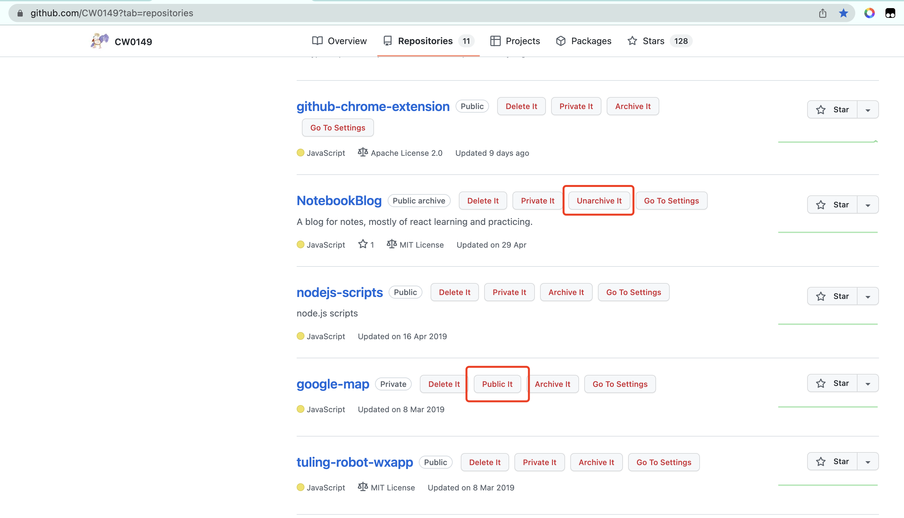

#  Github Repository Tools

This is an extension for Github repository page

After installing this extension, there will be tool buttons appear next to each of your repositories name.  

You can Delete,  Archive / UnArchive,  Change Visibility for each of your repository by just clicking the buttons.

Here's how it works:

Let's suppose you are checking your repositories, and you want to delete one of it, you will see a 'Delete It' button next the the repository name. After you clicking it, a popup will appear for your confirming in case you do it accidentally. Then by clicking the confirm button, it will be deleted.

It also provides a quick entrance for the each repository's settings page.  

## Install

The directory holding the manifest file can be added as an extension in developer mode in its current state. To load an unpacked extension in developer mode, follow these steps:

1. Download the release github.zip, and unzip it
2. Open the Extension Management page by navigating to chrome://extensions    

    * Alternatively, open this page by clicking on the Extensions menu button and selecting Manage Extensions at the bottom of the menu.

    * Alternatively, open this page by clicking on the Chrome menu, hovering over More Tools then selecting Extensions
3. Click the Load unpacked button and select the unzipped folder

## Build

Run `yarn build` will create a build folder, you can upload it in chrome://extensions

